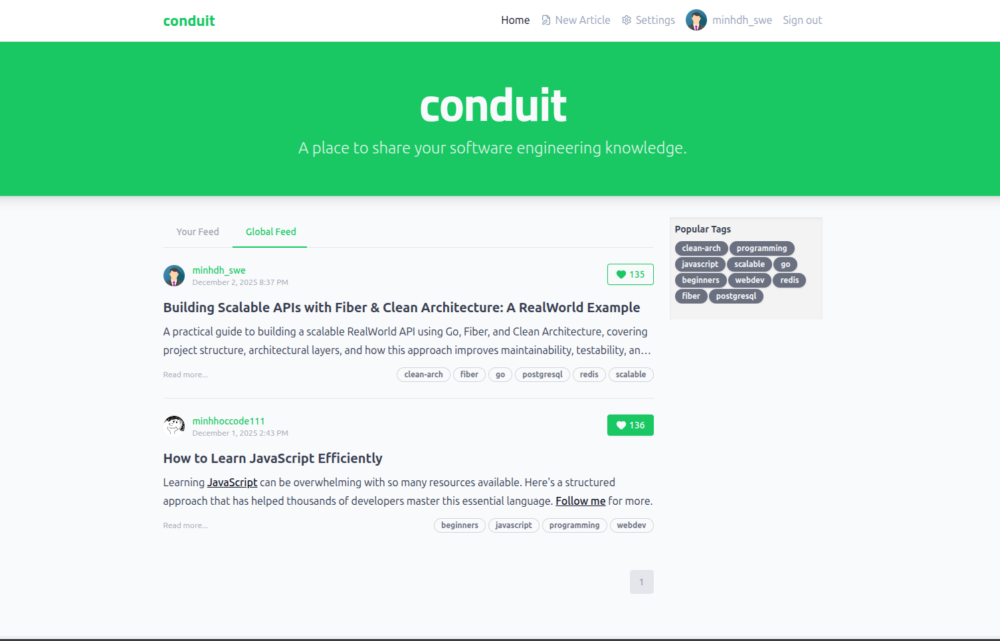
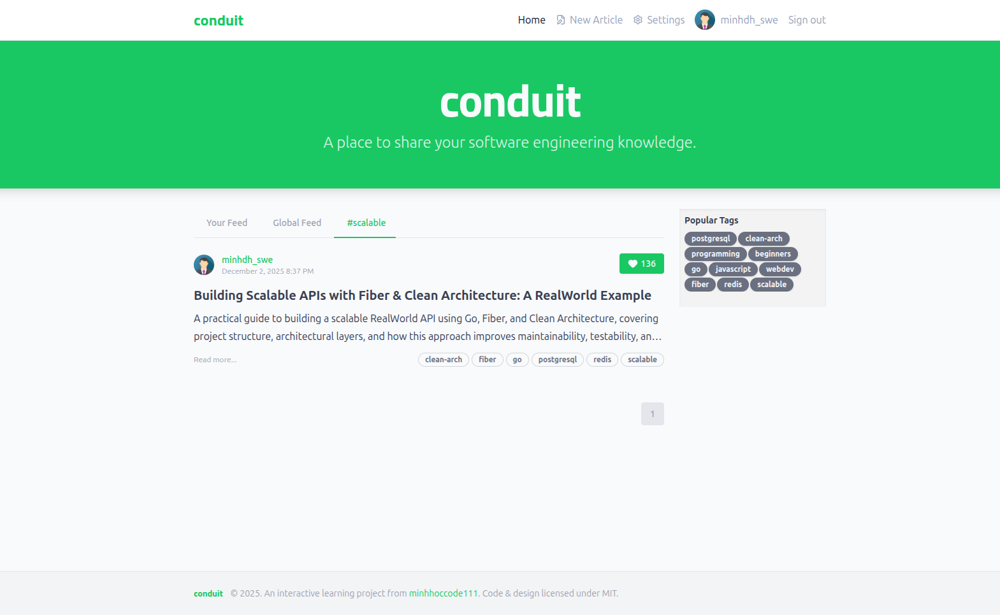
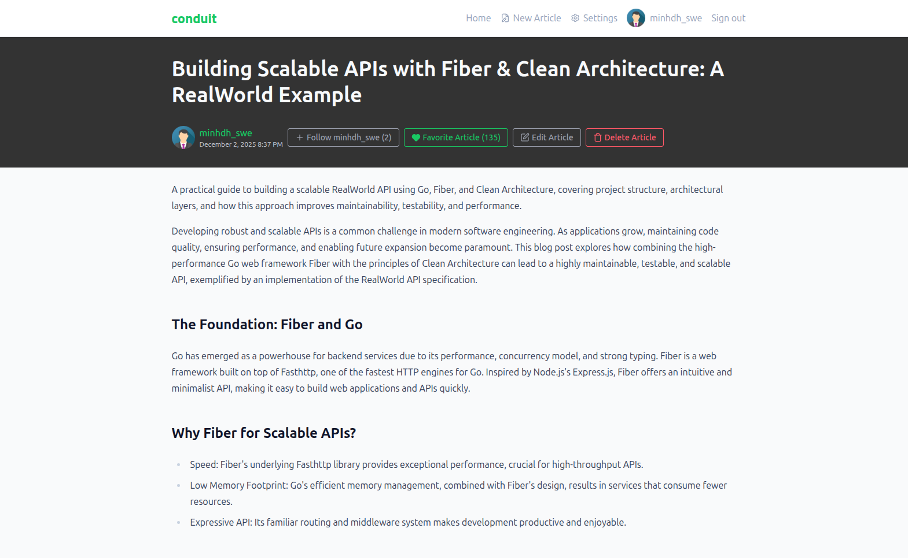
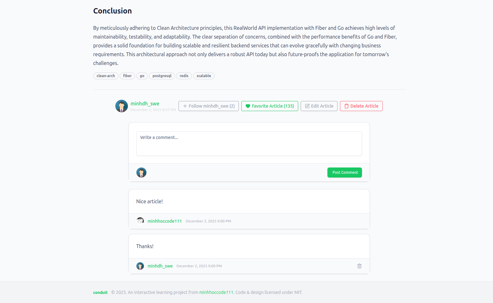
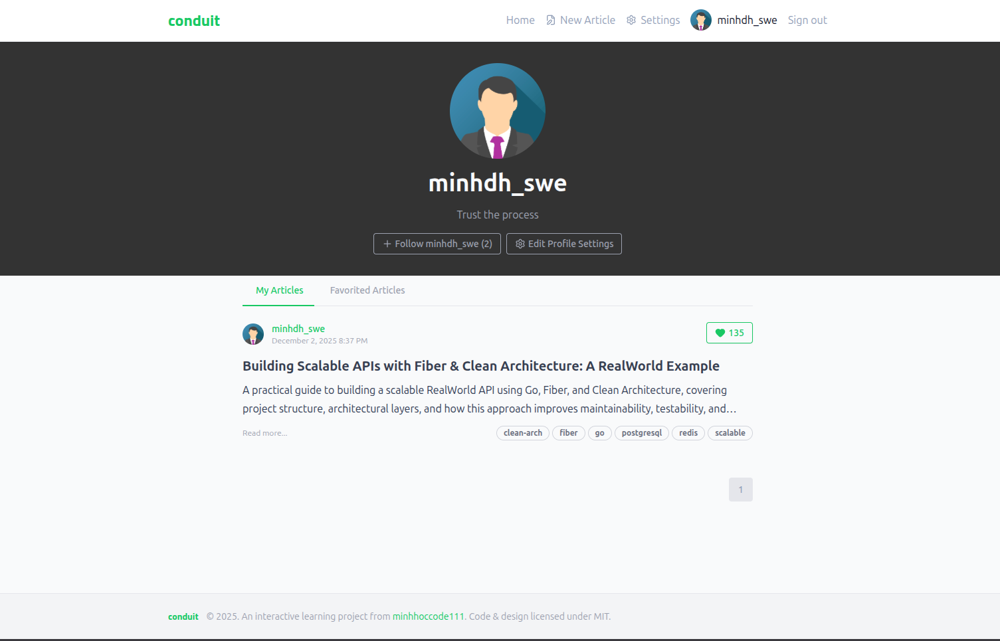
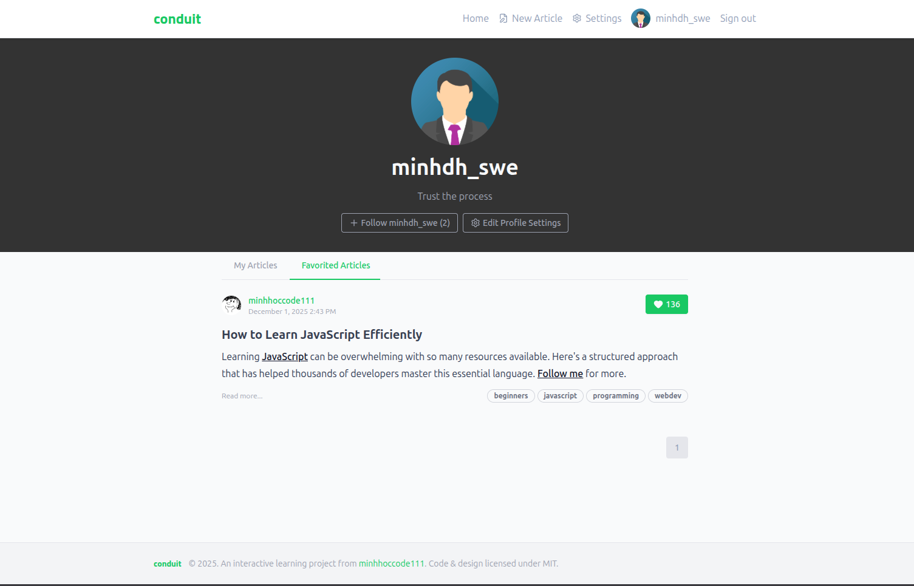

# Realworld & Bulletproof React

> ### React codebase containing real world examples (CRUD, auth, advanced patterns, etc) that adheres to the [RealWorld](https://github.com/gothinkster/realworld) specs.

## [Demo](https://realworld.minhhoccode111.com)

## [Swagger](https://realworldapi.minhhoccode111.com/swagger)

## Routing

- Home page (URL: /#/ )
  - List of tags
  - List of articles pulled from either Feed, Global, or by Tag
  - Pagination for list of articles
- Sign in/Sign up pages (URL: /#/login, /#/register )
  - Uses JWT (store the token in localStorage)
  - Authentication can be easily switched to session/cookie based
- Settings page (URL: /#/settings )
- Editor page to create/edit articles (URL: /#/editor, /#/editor/article-slug-here )
- Article page (URL: /#/article/article-slug-here )
  - Delete article button (only shown to article’s author)
  - Render markdown from server client side
  - Comments section at bottom of page
  - Delete comment button (only shown to comment’s author)
- Profile page (URL: /#/profile/:username, /#/profile/:username/favorites )
  - Show basic user info
  - List of articles populated from author’s created articles or author’s favorited articles

## Key Learnings & Implementations

This project delivered a robust, scalable React application, applying modern architectural patterns and best practices, largely inspired by "Bulletproof React Architecture." Key aspects included:

- **Bulletproof React Architecture & Project Structure:**
  - Structured the application with a feature-driven directory layout (`src/features`), organizing code by domain for enhanced maintainability and scalability, co-locating related components, hooks, and API logic.
  - Encapsulated API logic using `react-query`'s query options pattern (e.g., `getArticlesQueryOptions` in `src/features/articles/api`), ensuring highly reusable and testable API interactions.
- **Realworld React Frontend Specs:**
  - Implemented a practical, real-world application adhering to the RealWorld specification, showcasing advanced React patterns including comprehensive authentication, CRUD operations, and intricate state management.
- **Leveraging React Query for Data Fetching and Caching:**
  - Utilized React Query extensively for server state management, enabling powerful caching, automatic refetching, and seamless background updates vital for performance.
  - **Deep `clientLoader` Integration:** Integrated `react-router`'s `clientLoader`s directly with `react-query`, injecting `queryClient` into each route's `clientLoader` (via `src/app/router.tsx`'s `convert` function). This pattern pre-fetches data dependencies before components render, ensuring immediate data availability and eliminating loading spinners on initial page loads for known data.
  - **`prefetch` on Hover:** Implemented `prefetch` logic (e.g., in `article-meta.tsx`, `article-preview.tsx`) to pre-fetch data (user profiles, articles) on link hover, significantly improving perceived performance and user experience by preparing data before navigation.
  - **Strategic Query Invalidation & Cache Updates:** Developed detailed strategies for cache consistency post-mutations, including direct cache updates for optimistic UI and strategic invalidations for stale data (detailed in "React Query Cache Management").
- **Mastering React Router for Client-Side Navigation:**
  - Managed client-side navigation and URL synchronization.
  - Leveraged lazy loading for routes (`React.lazy`, `Suspense`) to optimize bundle size and initial load times.
  - **Deep Integration with `react-query`'s `clientLoader`:** This powerful combination ensures route data is fetched and ready before component mounts, creating a smoother user experience without data waterfalls.
- **Styling with Shadcn UI & TailwindCSS:**
  - Utilized `Shadcn UI` for re-usable, accessible, and customizable UI components built on Tailwind CSS and Radix UI.
  - Employed `TailwindCSS` as the utility-first CSS framework for rapid UI development and consistent design.
- **Managing Global State with Zustand:**
  - Selected `Zustand` for lightweight and performant global client-side state management, addressing UI preferences or notifications not covered by `react-query`.
- **Robust Form Handling with React Hook Form & Zod:**
  - Implemented `React Hook Form` for efficient form state and submission management.
  - Integrated `Zod` for robust schema-based form validation, ensuring strong type safety and data integrity.
- **Authentication and Authorization:**
  - Designed and implemented authentication and authorization using a `ProtectedRoute` component to secure routes and a `useAuth` hook for managing user authentication state and session, visible in `src/lib/auth.tsx`.
- **Key Advanced Patterns Applied:**
  - **Custom Hooks:** Created custom hooks (e.g., `useDisclosure.ts`) to encapsulate and reuse complex stateful logic, promoting cleaner component structures.
  - **Structured Error Handling:** Implemented a structured error handling approach, integrating with `react-query`'s error boundaries and establishing global mechanisms, particularly around `src/components/errors`.
- **Insights into Regex for Input Validation:**
  - Identified limitations of basic regex patterns for non-ASCII characters, highlighting the importance of internationalization considerations in input validation.

### React Query Cache Management

This section outlines how the application manages its React Query cache in response to various user actions, ensuring data consistency and optimal performance.

**Key Concepts:**

- **Cache Update:** Directly modifies an existing cache entry with new data without triggering a refetch. This is often used for optimistic updates or when the new data is immediately available after a mutation.
- **Cache Invalidation:** Marks one or more cache entries as "stale." When a component next tries to access a stale query, React Query will refetch the data from the API.

**Note on Article Lists:**
The application displays articles in five different list contexts, each corresponding to a distinct React Query cache key:

- **Feed:** Articles from users the current user follows.
- **Global:** All articles.
- **Tag:** Articles filtered by a specific tag.
- **Author:** Articles published by a specific author.
- **Favorited:** Articles favorited by a specific user.

Here’s a breakdown of cache management strategies for different actions:

- **Article Operations (Create, Update, Delete):**
  - **Single Article:**
    - `Article: Create/Update`: The specific `article` entry (identified by its slug) is directly updated in the cache with the new data.
    - `Article: Delete`: The specific `article` entry (identified by its slug) is removed from the cache.
  - **Article Lists:** All cached `articles` lists (Feed, Global, Tag, Author, Favorited) are invalidated to ensure they reflect the latest changes upon their next access.
- **Article: Favorite / Unfavorite:**
  - The specific `article` entry (identified by its slug) is immediately updated in the cache to reflect the new favorite status (optimistic update).
  - The corresponding article within all cached `articles` lists is also updated.
  - The `favorited-articles` queries are invalidated (preferably only for the current user) to refetch the updated list of favorited articles.
- **Profile: Update:**
  - The `authenticated-user` cache entry is updated.
  - The current user’s cached `profile` entry is invalidated.
  - All cached `articles` lists are invalidated, as a profile update might affect displayed author information or article counts.
- **Profile: Follow / Unfollow:**
  - The `profile` entry for the followed/unfollowed user (identified by their username) is updated in the cache to reflect the new follow status.
  - The current user’s `feed-articles` query is invalidated, as following/unfollowing impacts the articles shown in their personalized feed.
- **Comment Operations (Create, Delete):**
  - The `infinite-comments` query for the relevant article (identified by its slug) is invalidated to ensure the comment section displays the most current list of comments.

## Todo

- [x] Add `clientLoader`s to make requests before component renders
- [x] Add `prefetch` on hover actions
- [x] Add admin/user roles to manage users' content
- [x] Replace Bootstrap with ShadcnUI and TailwindCSS
- [x] Replace jwt-in-header with jwt-in-cookie for better security
- [ ] Add updating of an article's tags list
- [ ] Add filtering of articles using multiple tags

## Get Started

**Important:** This project requires a separate backend service to function. Please ensure you have the `realworld-fiber-clean` backend running.
To set up and start the backend:

1. Clone the repository: `git clone https://github.com/minhhoccode111/realworld-fiber-clean.git`
2. Navigate into the backend directory: `cd realworld-fiber-clean`
3. Install dependencies and run the services:
   ```bash
   make compose-up-all
   ```

Prerequisites:

- Node 20+
- Yarn 1.22+

To set up the app execute the following commands.

```bash
git clone https://github.com/minhhoccode111/realworld-react.git
cd realworld-react

bun install
```

##### `bun dev`

Runs the app in the development mode.\
Open [http://localhost:3000](http://localhost:3000) to view it in the browser.

##### `bun run build`

Builds the app for production to the `dist` folder.\
It correctly bundles React in production mode and optimizes the build for the best performance.

See the section about [deployment](https://vitejs.dev/guide/static-deploy) for more information.

## Contributing

Contributions are **welcome and highly appreciated**!\
This project follows the [RealWorld
Specs](https://github.com/gothinkster/realworld) — please make sure your changes
remain compliant.

## Preview

<details>
    <summary>Screenshots</summary>








</details>
